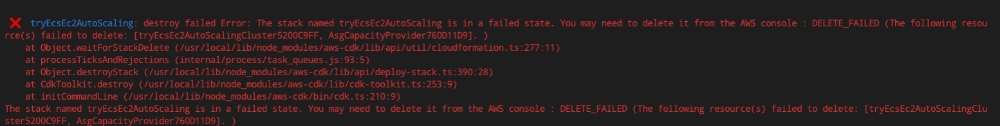
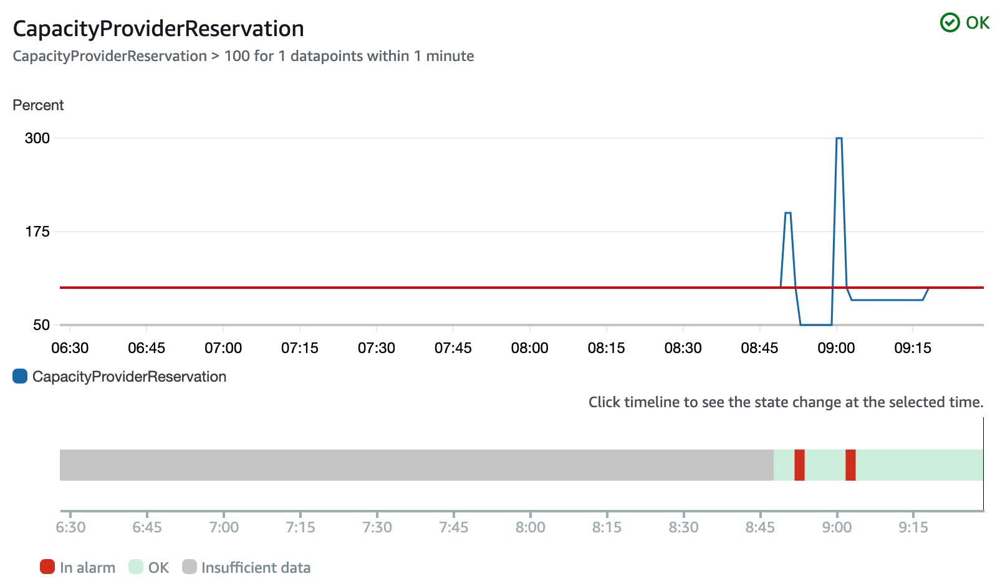
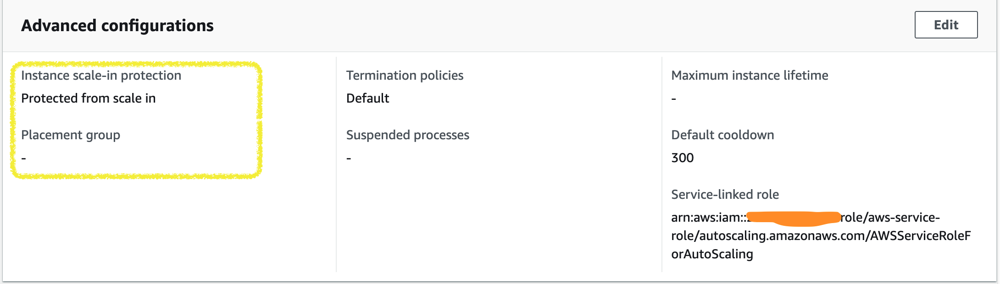

# Demo use EC2 Capacity Provider to Scaling AutoScaling Group for ECS tasks scaling out.

## To Clone
```bash
git clone https://github.com/neilkuan/ECS-EC2-Capacity-Provider-Demo.git
```

## Install package 
```bash
yarn
```

## To Deploy
```bash
cdk deploy
```

## To Destroy
```bash
cdk deploy
```
### If destroy fail, please `cdk destroy` again.


### ECS EC2 Capacity Provider Metrics.


### AutoScaling Group advanced configurations.
